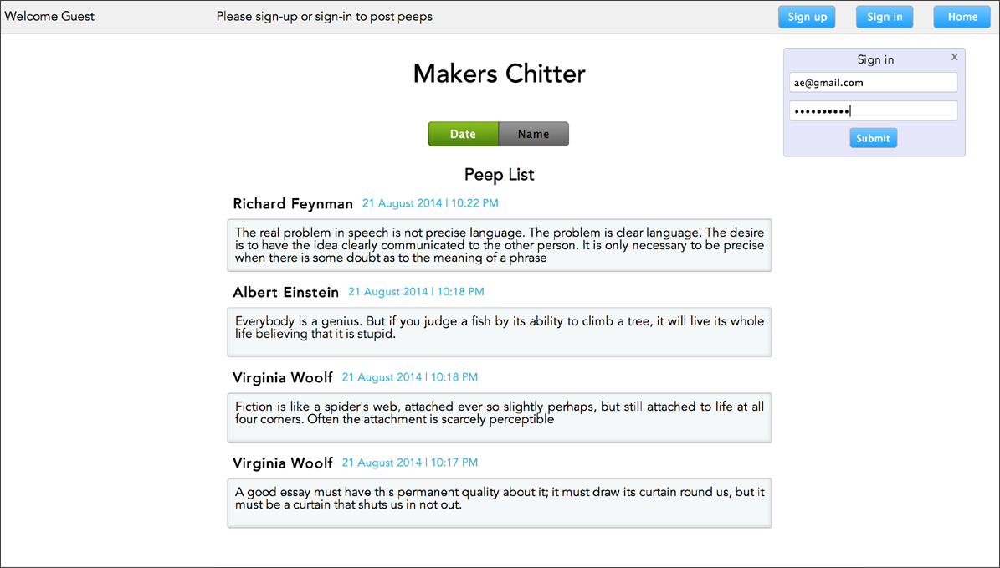
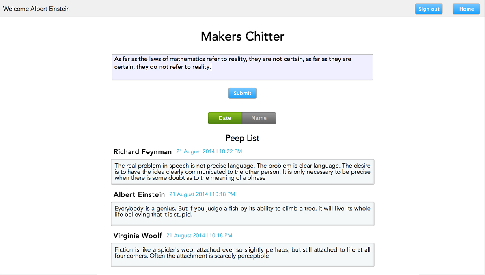
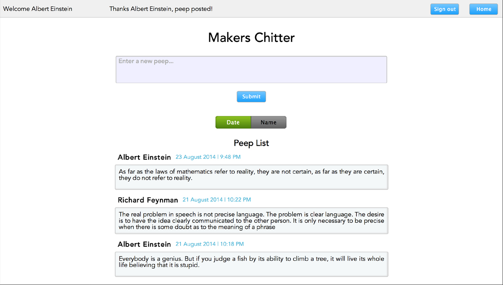

#Makers Chitter

##Makers Academy | Week 7 | Challenge

[](https://codeclimate.com/github/nadavmatalon/chitter)

##Table of Contents

* [Screenshots](#screenshots)
* [General Description](#general-description)
* [Guidelines](#guidelines)
* [See it Live on Heroku](#see-it-live-on-heroku)
* [How to Install](#how-to-install)
* [Browsers](#browsers)
* [Testing](#testing)
* [License](#license)


##Screenshots

<table>
	<tr>
		<td align="center" width=25% >
			<a href="https://raw.githubusercontent.com/nadavmatalon/chitter/master/public/images/chitter_1.jpg">
				
				Visit
			</a>
		</td>
		<td align="center" width=25% >
			<a href="https://raw.githubusercontent.com/nadavmatalon/chitter/master/public/images/chitter_2.jpg">
				
				Sign up
			</a>
		</td>
		<td align="center" width=25% >
			<a href="https://raw.githubusercontent.com/nadavmatalon/chitter/master/public/images/chitter_3.jpg">
				
				Compose a peep
			</a>
		</td>
		<td align="center" width=25% >
			<a href="https://raw.githubusercontent.com/nadavmatalon/chitter/master/public/images/chitter_4.jpg">
				
				And post it
			</a>
		</td>
	</tr>
</table>


##General Description

This repo contians my answer to __Week 7 Friday Challange__ as part 
of the course at [Makers Academy](http://www.makersacademy.com/).
 
The core of <strong>Makers Chitter</strong> was written over a weekend as 
an exercise in building an instant messaging web app for students 
at [Makers Mcademy](http://www.makersacademy.com/).

The app was written in [Ruby](https://www.ruby-lang.org/en/) according 
to [TDD](http://en.wikipedia.org/wiki/Test-driven_development).

Tests were generated with [Rspec](http://rspec.info) 
&amp; [Capybara](https://github.com/jnicklas/capybara).

It was built with the [Sinatra](http://www.sinatrarb.com/) framework and 
utilizes [Datamapper](http://datamapper.org/) to access a 
[PostgreSQL](http://www.postgresql.org/) database.

It also implements [bcrypt](https://github.com/codahale/bcrypt-ruby) to securly store only 
the digests of users' passwords.

__Update (21.8.14):__ parts of the app were re-written (mainly the front-side) 
to give it a nicer look, and a toggle-button was added which enables to display 
the list of peeps either according to the date of posting or the author's name.

__Update (23.8.14):__ added a new jQuery-based popup window in the main page for the 
sign in functionality (replacing the previous separate sign in page). Updated feature 
tests to accommodate the changes. 


##Guidelines

A summary of the guidlines for building the app were:

* The app allows users who visit the website to view the various 'peeps' which 
  were perviously posted.

* In order to post peeps, however, users must register with the app.

* Details of registered users and all their peeps are stored in a 
  [PostgreSQL](http://www.postgresql.org/) database.

* In terms of registration criteria, email addresses and usernames must be unique.


##See it Live on Heroku

A live version of the app can be found at:

[Makers Chitter on Heroku](http://makers-chitter.herokuapp.com)

As I'm using Heroku's free hosting service, the app may take a bit of time to upload<br/>
(Heroku's giros take time to wake up...), so please be patient.


##How to Install

To install the apo locally, clone the repo and run:

```bash
$> ch chitter
$> bundle instsll
$> shotgun
```

Then open the browser of your choice and go to:

```
http://localhost:9393/
```


##Browsers

 This app has been tested with and supports the following browsers (though it should hopefully
 look ok in other browsers as well):

* __Google Chrome__ (36.0)
* __Mozilla Firefox__ (31.0)
* __Apple Safari__ (7.0.5)

If the app doesn't look right in __Safari__ (content is showing but without any css styling), 
this may be due to the security settings. To solve this, under 'Perferences > privacy settings', 
check if 'Block cookies' is set to 'Always' and if it does change it to 'from third parties 
and advertisers' (that's the default). In addition, click the 'Remove all website data' 
to clear the session cookies. After that, it should work as it intended.


##Testing

Tests were written with [Rspec](http://rspec.info) (2.14.8) &amp; 
[Capybara](https://github.com/jnicklas/capybara) (2.3.0).

The tests cover both back-end logic and front-end functionality.

To run the tests in terminal: 

```bash
$> cd chitter
$> rspec
```

##License

<p>Released under the <a href="http://www.opensource.org/licenses/MIT">MIT license</a>.</p>

